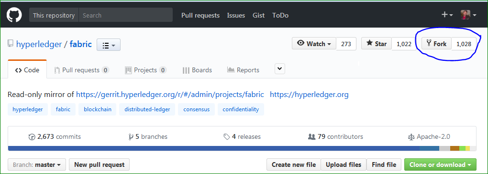

# GIT Introduction

Git is a version control system same as svn, cvs.. What is version Control system? 

When developers are creating something (an application, for example), they are making constant changes to the code and releasing new versions, up to and after the first official (non-beta) release.

Install Git client to work on local machine and publish changes to github (remote repository)

```
    sudo apt-get update
    sudo apt-get install git
```

## How to Setup Git

    git config --global user.name "Your Name"
    git config --global user.email "youremail@domain.com"

    
## Git Workflow
After you install git client in your local machine, first step is to fork origin repository from github.



Once successfully forked repository into your github account, clone your forked repository into your local machine.

```
git clone https://github.com/rameshthoomu/fabric.git
```

Once successfully cloned your remote repository into your local machine. Start your git flow from here.. Follow below steps

### Step 1: 

Create Workbranch

``` 
git checkout -b workbranch 
```

Add changes/create files with changes
<< Do your work here>>

list all your changes

```
git status
```

Add changes to staging area

```
git add <required files>
```

Commit your changes to local repository

```
git commit -m <Commit message>
```

before push changes to your remote repository, check on which remote repository you are working on 

```
git remote -v
```

### Step 2
Push Changes to remote repository

```
git push origin <branch>
```
or
```
git push https://github.com/rameshthoomu/fabric.git master
```

Add more work and follow above steps.. Instead of creating a new commit, amend your changes on previous commit

```
git commit --amend
```

### Step 3

Once you push required changes, Create a Pull Request from github repository to upstream repository and work on further review comments.

Once the Pull Request is merged by the maintainers of the project you can delete your workbranch.

# Git Commands

### Delete Local Branch:
`git branch -D <branchName>`

### Delete Remote Branch:
`git push upstream :<branchName>` or `git push upstream --delete <branchName>`

### View just remote-tracking branches
```
git branch --remotes
git branch -r
```

### View both strictly local as well as remote-tracking branches
```
git branch --all
git branch -a
```
### Delete all the remote branch which are not exited in local

```
git push --prune origin
```
### Rename git branch

```
git branch -m <oldName> <newName>```
git push upstream :oldname < Deletes old branch from remote>
git push --set-upstream origin newName <new local to track a new remote branch>
```

### Sync Remote Rep with local and push changes to remote repo
```
git remote add upstream https://github.com/rameshthoomu/fabric.git
git fetch upstream
git merge upstream/master
git push upstream master
```
### Changing remote url's
```
git remote -v
$ git remote -v
origin  https://github.com/hyperledger/fabric.git (fetch)
origin  https://github.com/hyperledger/fabric.git (push)
upstream        https://github.com/rameshthoomu/fabric.git (fetch)
upstream        https://github.com/rameshthoomu/fabric.git (push)
git remote set-url upstream https://github.com/rameshthoomu79/fabric.git <new url>
upstream        https://github.com/rameshthoomu79/fabric.git (fetch)
upstream        https://github.com/rameshthoomu79/fabric.git (push)
```
